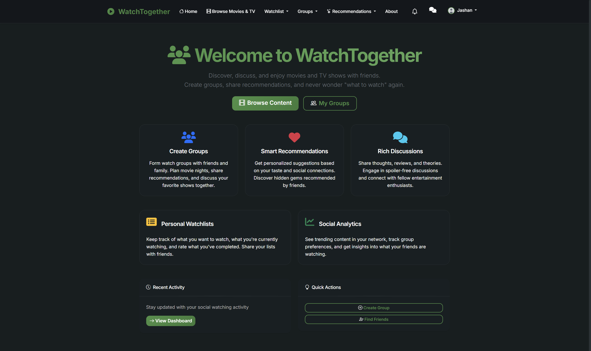

# WatchTogether 🎮🎥

A collaborative movie and TV show discovery platform that brings friends together through shared entertainment experiences.



---

## 🌍 Overview

**WatchTogether** is a social platform that answers the age-old question: *"What should we watch tonight?"*. With deep integration with **The Movie Database (TMDB)** and social features like shared watchlists and group discussions, it's designed to make decision-making fun, collaborative, and stress-free.

---

## 🔧 Features

### 🎯 Core Features

* 🔐 **User Authentication & Profiles**: Secure sign-up/login and customizable profiles
* 👥 **Group Management**: Create or join watch groups with friends & family
* 📱 **Content Discovery**: Browse trending movies & TV shows using TMDB
* 🍿 **Collaborative Watchlists**: Share watchlists and vote on what to watch
* ⭐ **Rating & Reviews**: Rate content and write detailed reviews
* 🔗 **Discussion Forums**: Chat about shows and movies in groups
* 🤖 **Smart Recommendations**: AI-powered suggestions based on group tastes

### 👫 Social Features

* 🤝 **Friend System**: Add and manage friends
* 🎉 **Group Invitations**: Invite friends to join your watch parties
* 📢 **Notifications**: Stay in the loop with real-time updates
* 🌐 **Social Analytics**: Visualize group watching trends

### ⚖️ Advanced Features

* 🎙️ **Proposal System**: Suggest content and vote as a group
* 🔢 **Content Analytics**: Discover insights on group preferences
* 🔒 **Privacy Controls**: Robust control over your activity and profile
* 🛡️ **Report System**: Keep discussions safe and respectful
* 📺 **Multi-platform Support**: Check availability across streaming platforms

---

## 📊 Technology Stack

### Backend

* Flask 2.3.3 ✨
* SQLAlchemy + SQLite (PostgreSQL/MySQL supported)
* Flask-Login for session management
* Flask-WTF & CSRF Protection
* Werkzeug for secure password hashing

### Frontend

* Jinja2 Templates 📄
* Bootstrap 5 + Custom CSS 🎨
* Vanilla JavaScript 🎡
* Font Awesome + Bootstrap Icons ✨

### External APIs

* TMDB API 🎬
* scikit-learn 🧬 (for AI recommendations)

### Dev Tools

* python-dotenv 🛠️
* Pillow (image processing)
* requests (API calls)
* email-validator 📧

---

## 📚 Installation

### Prerequisites

* Python 3.8+
* TMDB API Key ([Sign up](https://www.themoviedb.org/settings/api))

### Setup

```bash
git clone https://github.com/JashanMaan28/WatchTogether.git
cd WatchTogether
python -m venv venv

# Windows:
venv\Scripts\activate

# macOS/Linux:
source venv/bin/activate

pip install -r requirements.txt
```

### Environment Variables

Create a `.env` file:

```env
SECRET_KEY=your-secret-key
TMDB_API_KEY=your-tmdb-api-key
FLASK_ENV=development
DATABASE_URL=sqlite:///watchtogether.db
```

### Launch App

```bash
python run.py
```

Visit `http://localhost:5000`

---

## 🔄 Usage Guide

1. 👤 **Create Account**: Register and upload a profile pic
2. 🏡 **Start/Join Groups**: Organize watch groups with friends
3. 💼 **Add Content**: Add to watchlists and vote what to watch next
4. ⭐ **Rate & Review**: Leave ratings & detailed reviews
5. 💬 **Start Discussions**: Engage in group discussions around content

### 🧰 Admin Features

* Manage group members & roles
* Moderate content/discussions
* View group analytics

---

## 🚀 API Endpoints

### Auth

* `POST /auth/register`
* `POST /auth/login`
* `GET /auth/logout`
* `GET /auth/profile`
* `POST /auth/edit_profile`

### Groups

* `GET /groups`
* `POST /groups/create`
* `GET /groups/<id>`
* `POST /groups/<id>/join`
* `DELETE /groups/<id>/leave`

### Content

* `GET /content`
* `GET /content/<id>`
* `POST /content/search`
* `POST /watchlist/add`
* `POST /ratings/add`

### Discussions

* `GET /discussions`
* `POST /discussions/create`
* `GET /discussions/<id>`
* `POST /discussions/<id>/reply`

---

## 📝 Database Schema

* **User**: User accounts and profiles
* **Group**: Watch groups
* **GroupMember**: Memberships and roles
* **Content**: TMDB-sourced content
* **UserWatchlist**: Personal watchlist entries
* **GroupWatchlist**: Shared group lists
* **ContentRating**: Ratings and reviews
* **Discussion**: Group chats
* **Notification**: Alerts and activity updates
* **WatchSession**: Scheduled viewing events

---

## ⚙️ Config & Deployment

| Variable       | Description          | Required | Default                    |
| -------------- | -------------------- | -------- | -------------------------- |
| `SECRET_KEY`   | Flask session key    | Yes      | -                          |
| `TMDB_API_KEY` | TMDB API key         | Yes      | -                          |
| `FLASK_ENV`    | Flask environment    | No       | development                |
| `DATABASE_URL` | DB connection string | No       | sqlite:///watchtogether.db |

### Environments Supported

* Development
* Production
* Testing (in-memory DB)

---

## 💼 Project Structure

```
WatchTogether/
├── app.py                 # Flask application factory
├── config.py              # Configuration settings
├── run.py                 # Application entry point
├── requirements.txt       # Python dependencies
├── models/               # Database models
│   └── __init__.py       # User, Group, Content models
├── routes/               # Application routes
│   ├── auth.py           # Authentication routes
│   ├── content.py        # Content browsing routes
│   ├── groups.py         # Group management routes
│   ├── watchlist.py      # Watchlist routes
│   ├── ratings.py        # Rating and review routes
│   ├── discussions.py    # Discussion forum routes
│   └── recommendations.py # Recommendation routes
├── templates/            # Jinja2 templates
│   ├── base.html         # Base template
│   ├── auth/             # Authentication templates
│   ├── content/          # Content browsing templates
│   ├── groups/           # Group management templates
│   └── discussions/      # Discussion templates
├── static/               # Static assets
│   ├── css/              # Stylesheets
│   ├── js/               # JavaScript files
│   └── images/           # Static images
└── utils/                # Utility modules
    ├── tmdb_api.py       # TMDB API integration
    ├── recommendation_engine.py # ML recommendations
    └── social_analytics.py # Analytics utilities
```

## 💡 Future Ideas

This project has a lot of potential! Here are some ideas for future development:

### 🌐 Deeper Content & Social Integration

* 🎥 **Real-time Watch Parties**: Synchronize video playback with a group chat overlay for a shared viewing experience.
* 🌍 **Expanded API Integration**: Integrate with IMDb, Rotten Tomatoes, and Metacritic for aggregated ratings and reviews.
* 🔗 **"Where to Watch" Service**: Direct links to watch content on streaming services like Netflix, Hulu, Disney+, etc.
* ▶️ **In-App Trailer Playback**: Watch trailers directly within the WatchTogether interface.
* 📰 **Activity Feed**: A central feed to see what friends are watching, rating, and discussing.

### 🎮 Gamification & Engagement

* 🏅 **Badges & Achievements**: Earn badges for milestones like rating 100 movies or starting 10 discussions.
* 📊 **Group Leaderboards**: Friendly competition to track viewing and review stats.
* 🎯 **Weekly "Watch Challenges"**: Participate in themed challenges like "Watch a movie from the 80s."

### 📱 Platform Expansion

* 📲 **Mobile Applications**: Native iOS and Android apps.
* 🧩 **Browser Extension**: Add content to watchlists directly from any website.
* 🤖 **Discord Bot**: Manage watchlists and polls inside Discord.

### 🧠 Smarter & More Personalized AI

* 🎛️ **Advanced Recommendation Filters**: Filter by mood, sub-genre, or "similar to X but with Y."
* 🧾 **AI-Generated Group Summaries**: Insights like "Your group loves sci-fi comedies but dislikes horror."
* 🚫 **"Avoid Spoilers" Mode**: Hide potential spoilers in discussions until confirmed watched.

### 🛡️ Security

* CSRF Protection for forms
* Password Hashing using Werkzeug
* SQL Injection Prevention with SQLAlchemy
* Input Validation and Sanitization

---

## 🔒 Security Highlights

* CSRF-protected forms
* Hashed passwords via Werkzeug
* Input validation on all forms
* ORM-based queries (prevents SQL injection)
* Granular privacy settings

---

## ⚡ Performance Tips

* Indexed database queries
* Static & template caching
* Profile image compression
* Lazy loading for heavy assets
* Asynchronous processing for ML tasks

---

## 🚫 Troubleshooting

1. **TMDB Errors**: Check `.env` and verify your API key
2. **DB Errors**: Try resetting DB or reviewing permissions
3. **Dependency Issues**: Reinstall with `pip install -r requirements.txt`
4. **Email**: Not fully implemented — app works without email settings

---

## 🌎 Acknowledgments

* 🎬 [The Movie Database (TMDB)](https://www.themoviedb.org/)
* 🔧 Flask & its ecosystem
* 🌈 Bootstrap for beautiful UI
* ✨ Font Awesome & Bootstrap Icons

---

## 🙌 Support

For bug reports, ideas, or help:
[GitHub Issues](https://github.com/JashanMaan28/WatchTogether/issues)

---

**WatchTogether** — Making movie nights better, *together*! 🍿✨

<div align="center">

**Made with ❤️ by [Jashan](https://jashanpreetsingh.tech)**

*For entertainment, and fun!*

[](https://github.com/JashanMaan28)
